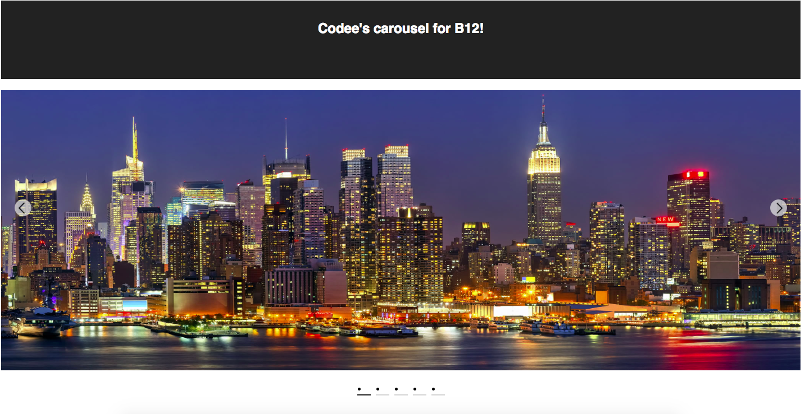

# Codee's Image Carousel for B12 Coding Challenge!

Welcome to Codee's repository for a simple front-end image carousel created on React using create-react-app as a base.

Please run these commands to run the carousel on localhost:

```
git clone https://github.com/codeeong/b12.git

cd b12

npm install

npm start

```

Open http://localhost:3000 to view it in your browser.


This is what you should see when it starts up!

Various online resources and existing tutorials were referenced to make this carousel within the allocated time!
